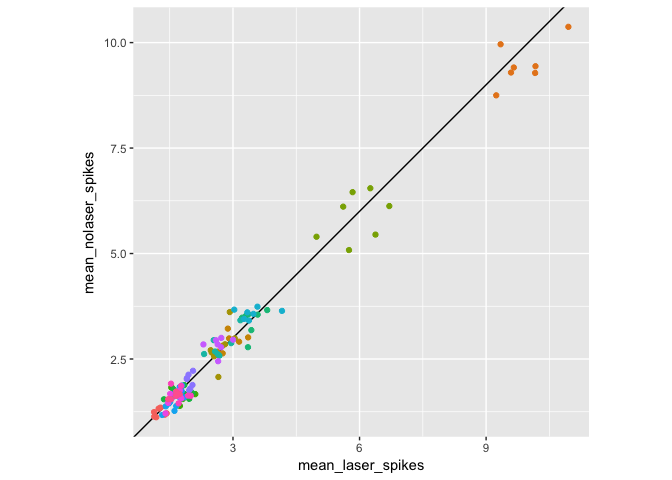
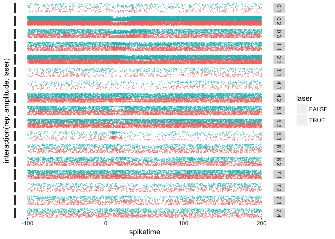
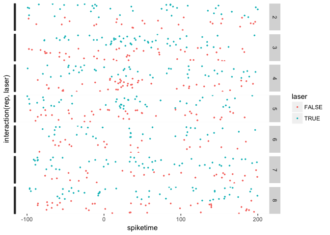
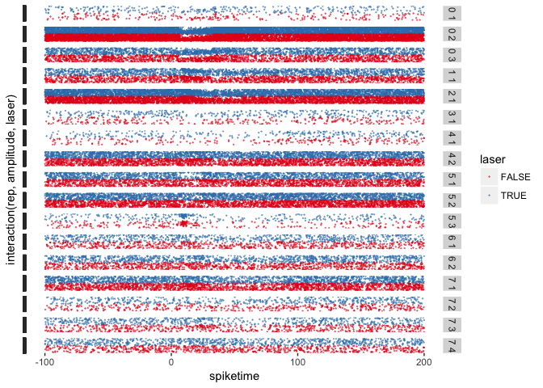
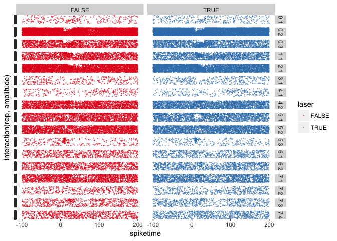
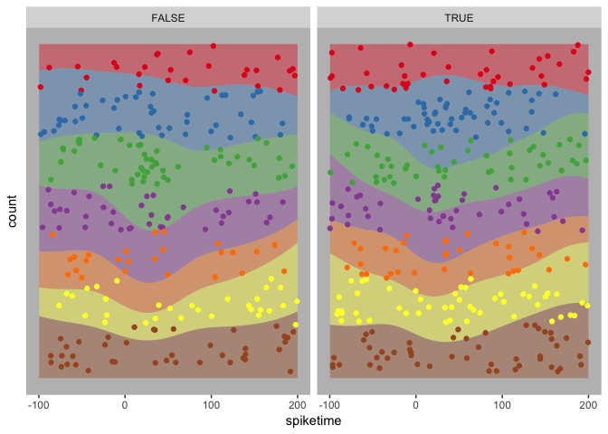

-   [Why R?](#why-r)
-   [Basic Syntax](#basic-syntax)
-   [Packages](#packages)
-   [Loading data](#loading-data)
-   [Manipulating Data](#manipulating-data)
-   [Plots](#plots)
-   [Stats](#stats)
-   [firing rate by amplitude within
    cells](#firing-rate-by-amplitude-within-cells)
    -   [ANOVAs, nested analysis,
        skillings-mac](#anovas-nested-analysis-skillings-mac)

Why R?
======

-   Purpose-built for stats & data analysis - syntax is straightforward,
    well-implemented, and relatively static
-   R Community - huge amount of centrally hosted, well-designed
    software with documentation to match. (vs. the nightmarish
    MATLAB central)
-   Free, Open Source - Important not only for the state and future of
    computing, but also for open, reproducible science because your code
    can be run by anyone even if they don't have a MATLAB site license.
-   Typesetting - do your statistics in the same document as your
    manuscript, never worry about copy and pasting a number wrong.
-   Plotting - ggplot2 makes MATLAB plotting look like crayon playtime

Basic Syntax
============

R has some familiar and some unfamilar syntax.

Assignment works using both the `<-` (typical) and `=` operators, they
are slightly different but in most cases are interchangeable

    x <- 1
    x

    ## [1] 1

Get help with `?`

    ?lm

The most basic data class, a list, is declared with the `c()` operator.
See my lesson on
[objects](https://uodatascience.github.io/R_Guide/0201_Objects.html) for
more detail. some examples:

    # Vector
    x <- c(1,2,3,4,5,6)
    x

    ## [1] 1 2 3 4 5 6

    # Indexing uses []
    x[2]

    ## [1] 2

    # Matrices (arrays w/ 2 dimensions)
    y <- matrix(1:24, ncol=3, nrow=8)
    y

    ##      [,1] [,2] [,3]
    ## [1,]    1    9   17
    ## [2,]    2   10   18
    ## [3,]    3   11   19
    ## [4,]    4   12   20
    ## [5,]    5   13   21
    ## [6,]    6   14   22
    ## [7,]    7   15   23
    ## [8,]    8   16   24

    # A vector can be made an array in a few ways
    matrix(x, nrow=2, ncol=3)

    ##      [,1] [,2] [,3]
    ## [1,]    1    3    5
    ## [2,]    2    4    6

    dim(x) <- c(2,3)

Data frames are one of the main ways of storing data, some examples:

    # Pull an existing dataframe for an example
    diamonds <- ggplot2::diamonds # the :: notation accesses a name from a package without loading the package

    head(diamonds) # show the first six rows and the header of a dataframe

    ## # A tibble: 6 x 10
    ##   carat       cut color clarity depth table price     x     y     z
    ##   <dbl>     <ord> <ord>   <ord> <dbl> <dbl> <int> <dbl> <dbl> <dbl>
    ## 1  0.23     Ideal     E     SI2  61.5    55   326  3.95  3.98  2.43
    ## 2  0.21   Premium     E     SI1  59.8    61   326  3.89  3.84  2.31
    ## 3  0.23      Good     E     VS1  56.9    65   327  4.05  4.07  2.31
    ## 4  0.29   Premium     I     VS2  62.4    58   334  4.20  4.23  2.63
    ## 5  0.31      Good     J     SI2  63.3    58   335  4.34  4.35  2.75
    ## 6  0.24 Very Good     J    VVS2  62.8    57   336  3.94  3.96  2.48

    # Access named columns like this
    diamonds$carat[1:5]

    ## [1] 0.23 0.21 0.23 0.29 0.31

    # Logical indexing is similar to MATLAB

    diamonds[diamonds$carat >= 5,] 

    ## # A tibble: 1 x 10
    ##   carat   cut color clarity depth table price     x     y     z
    ##   <dbl> <ord> <ord>   <ord> <dbl> <dbl> <int> <dbl> <dbl> <dbl>
    ## 1  5.01  Fair     J      I1  65.5    59 18018 10.74 10.54  6.98

    # The additional comma is because the logical statement selects rows, a blank after a comma selects all the columns. For example, if we just wanted the first column we could
    diamonds[diamonds$carat >= 5,1] 

    ## # A tibble: 1 x 1
    ##   carat
    ##   <dbl>
    ## 1  5.01

    # or equivalently
    diamonds[diamonds$carat >= 5,]$carat

    ## [1] 5.01

Packages
========

Packages are installed from [https://cran.r-project.org](CRAN) by
default using

    # install.packages("package_name")

    # Install all the packages used in this demo
    # note that tidyverse is a metapackage that contains a lot of sub-packages
    # eg. plyr, which i will often refer to by name and load separately
    # install.packages(c("rio", "ggplot2", "R.matlab", "tidyverse", binom))

Installed packaged are loaded into an R session using

    #library("package_name")

    # for example, load the packages that we'll be using
    library("ggplot2")
    library("rio")
    library("R.matlab")

    ## R.matlab v3.6.1 (2016-10-19) successfully loaded. See ?R.matlab for help.

    ## 
    ## Attaching package: 'R.matlab'

    ## The following objects are masked from 'package:base':
    ## 
    ##     getOption, isOpen

    library("reshape2")
    library("plyr")
    library("binom")

    # If this is the first time you have loaded rio, you will be told you are missing some packages. install them too
    #install_formats()

Loading data
============

The `rio` package's `import` function makes importing other data formats
easy, it wraps a bunch of other packages that handle the actual
importing. In this case though, since the out files are mega-nested
gnarly matlab structures, we have to use `R.matlab`'s more flexible
`readMat` function.

We'll load some of Aldis' data, comparing spiking activity in mice
injected with halorhodopsin with and without laser stimulation. Because
loading the data using `readMat` takes forever, I'll just leave this
here, unevaluated, and used a cached version of that data. This is
shitty code, but I'm leaving it all in a for loop so make it linearly
readable.

    # Set this to wherever the repo landed on your computer
    laser_folder <- "/Users/jonny/GitHub/R_crash_course/data/laser"
    laser_files <- dir(laser_folder, pattern="outPSTH*")

    # Make a blank dataframe with our field names and data types
    laser_data <- data.frame(channel=integer(),
                             cluster=integer(),
                             laser=logical(),
                             amplitude=integer(),
                             rep=integer(),
                             spiketime=double())

    # loop through out files
    for(f in laser_files){
      print(f)
      # Load the file
      file <- file.path(laser_folder, f)
      out <- R.matlab::readMat(file)
      out <- out$out
      
      # Get field names for numerical indexing with which()
      field_names <- names(out[,,1])
      
      # Laser off first
      las_off <- which(field_names == "M1OFF")
      off <- drop(out[las_off,1,1][[1]]) # Get the M1OFF field, dropping singleton dimensions
      
      # A series of manipulation functions that massage the data into into "long" format
      off <- plyr::adply(off, c(1,2)) # adply usually applies a function, but here we just want it to group values by the first two dimensions of the array (amplitude and trial) and concatenate
      off <- melt(off, id.vars=c("X1","X2"), na.rm=TRUE) # Now we want to melt this back down so the columns with multiple spike times are flattened to a single column
      off <- off[,c(1,2,4)] # Subset the dataframe, leaving behind the spike # column
      
      # Format dataframe for concatenation
      names(off) <- c("amplitude", "rep", "spiketime") # rename fields
      off <- off[order(off$amplitude, off$rep),] # reorder by amp then rep
      off$amplitude <- as.integer(off$amplitude) # changing types and adding other variables
      off$rep <- as.integer(off$rep)
      off$channel <- as.integer(substr(f,11,11))
      off$cluster <- as.integer(substr(f,13,13))
      off$laser <- TRUE
      
      # then laser on
      las_on <- which(field_names == "M1ON")
      on <- drop(out[las_on,1,1][[1]])
      on <- plyr::adply(on, c(1,2))
      on <- melt(on, id.vars=c("X1","X2"), na.rm=TRUE)
      on <- on[,c(1,2,4)]
      
      # Format dataframe for concatenation
      names(on) <- c("amplitude", "rep", "spiketime")
      on <- on[order(on$amplitude, on$rep),]
      on$amplitude <- as.integer(on$amplitude)
      on$rep <- as.integer(on$rep)
      on$channel <- as.integer(substr(f,11,11))
      on$cluster <- as.integer(substr(f,13,13))
      on$laser <- FALSE
      
      # Concatenate to dataframe
      laser_data <- rbind(laser_data, off, on)
    }

    save(laser_data,file="/Users/jonny/GitHub/R_crash_course/data/laser.RData")

    # Load the laser data to the global environment
    load("/Users/jonny/GitHub/R_crash_course/data/laser.RData", .GlobalEnv)

    # Now our data is in the 'long' format
    head(laser_data)

    ##     amplitude rep  spiketime channel cluster laser
    ## 1           2   1  -6.733333       0       1  TRUE
    ## 8           2   2 187.666667       0       1  TRUE
    ## 50          2   8 -64.133333       0       1  TRUE
    ## 106         2  16  87.933333       0       1  TRUE
    ## 113         2  17 182.833333       0       1  TRUE
    ## 127         2  19 -97.400000       0       1  TRUE

Manipulating Data
=================

Once we have our data in the long format, manipulating it is trivial

    # we use ddply to summarize our data by cell (channel, cluster), amplitude, repetition, and laser on/off
    # first make a cell column that just groups channel and cluster into one column
    laser_data$cell <- paste(laser_data$channel,laser_data$cluster)

    rep_spikes <- ddply(laser_data, .(cell, amplitude, laser, rep), summarize,
                        n_spikes = length(spiketime))
    head(rep_spikes)

    ##   cell amplitude laser rep n_spikes
    ## 1  0 1         2 FALSE   4        1
    ## 2  0 1         2 FALSE  18        1
    ## 3  0 1         2 FALSE  21        1
    ## 4  0 1         2 FALSE  23        1
    ## 5  0 1         2 FALSE  29        1
    ## 6  0 1         2 FALSE  40        1

    # Or collapsing across repetitions
    spikes <- ddply(rep_spikes, .(cell, amplitude, laser), summarize,
                    mean_spikes = mean(n_spikes),
                    sd_spikes = sd(n_spikes))

    head(spikes)

    ##   cell amplitude laser mean_spikes sd_spikes
    ## 1  0 1         2 FALSE    1.120000 0.3316625
    ## 2  0 1         2  TRUE    1.181818 0.4646602
    ## 3  0 1         3 FALSE    1.179487 0.3887764
    ## 4  0 1         3  TRUE    1.384615 0.6733805
    ## 5  0 1         4 FALSE    1.324324 0.5298875
    ## 6  0 1         4  TRUE    1.236842 0.5419789

    # Or by laser condition
    spikes_xy <- ddply(rep_spikes, .(cell, amplitude), summarize,
                       mean_laser_spikes = mean(n_spikes[laser==TRUE]),
                       mean_nolaser_spikes = mean(n_spikes[laser==FALSE]))

Some examples from my behavior data

    load("/Users/jonny/GitHub/R_crash_course/data/gendat.RData", .GlobalEnv)

    head(gendat)

    ##       trialNumber consonant speaker vowel token correct gentype step
    ## 42272       45936         2       2     1     1       1       1   15
    ## 42273       45937         2       1     1     1       1       1   15
    ## 42274       45938         2       2     1     1       1       1   15
    ## 42275       45939         1       2     1     1       1       1   15
    ## 42276       45941         1       2     1     1       1       1   15
    ## 42277       45943         2       4     6     2       0       3   15
    ##       session     date response target mouse toknov spknov vownov allnov
    ## 42272     105 736517.8        1      1  6924      0      0      0      0
    ## 42273     105 736517.8        1      1  6924      0      0      0      0
    ## 42274     105 736517.8        1      1  6924      0      0      0      0
    ## 42275     105 736517.8        0      0  6924      0      0      0      0
    ## 42276     105 736517.8        0      0  6924      0      0      0      0
    ## 42277     105 736517.8        0      1  6924      0      0      0      1
    ##       gentype2 novelnot
    ## 42272        1        0
    ## 42273        1        0
    ## 42274        1        0
    ## 42275        1        0
    ## 42276        1        0
    ## 42277        5        1

    gendat.mouse_type <- ddply(gendat,.(mouse,gentype2),plyr::summarize, 
                          meancx   = mean(correct),
                          meanresp = mean(response),
                          meantarg = mean(target),
                          cilo     = 
                            binom.confint(sum(correct),length(correct),conf.level=0.95,method="exact")[[5]],
                          cihi     =
                            binom.confint(sum(correct),length(correct),conf.level=0.95,method="exact")[[6]],
                          nobs     = length(correct))

    head(gendat.mouse_type)

    ##   mouse gentype2    meancx  meanresp  meantarg      cilo      cihi  nobs
    ## 1  6924        1 0.6903276 0.5152216 0.5008863 0.6822914 0.6982783 12975
    ## 2  6924        2 0.6666667 0.4650794 0.4587302 0.6283466 0.7034157   630
    ## 3  6924        3 0.6718750 0.4973958 0.4869792 0.6224206 0.7186548   384
    ## 4  6924        4 0.6505429 0.5074038 0.4876604 0.6202834 0.6799244  1013
    ## 5  6924        5 0.6112084 0.4973730 0.4956217 0.5822408 0.6396015  1142
    ## 6  6925        1 0.7922657 0.4775890 0.5529330 0.7851904 0.7992100 13007

Plots
=====

More detail on plotting can be found in my
[https://github.com/uodatascience/ggplot\_guide](ggplot%20guide), but a
quick plot shows us what we have

    g.spikes_xy <- ggplot(spikes_xy, aes(x=mean_laser_spikes, y=mean_nolaser_spikes, color=cell))+
      geom_abline(intercept=0, slope=1)+
      geom_point()+
      coord_fixed()+
      theme(legend.position = "none")
    g.spikes_xy

    g.spike_ranges <- ggplot(spikes, aes(x=laser, color=as.factor(cell)))+
      geom_pointrange(aes(y=mean_spikes, ymin=mean_spikes-sd_spikes, ymax=mean_spikes+sd_spikes), size=0.3)+
      facet_grid(.~amplitude, scales="free")+
      theme(legend.position = "none")
    g.spike_ranges

the good ole raster

    g.raster <- ggplot(laser_data[laser_data$cell == "0 1",])+
      geom_point(aes(x=spiketime, y=interaction(rep,laser), color=laser), size=0.5)+
      facet_grid(amplitude~.)+
      theme(axis.text.y = element_blank())
    g.raster

    g.raster_all <- ggplot(laser_data)+
      geom_point(aes(x=spiketime, y=interaction(rep,amplitude,laser), color=laser), size=0.1, alpha=0.5)+
      facet_grid(cell~.)+
      theme(axis.text.y = element_blank())
    g.raster_all

    g.raster_side <- ggplot(laser_data)+
      geom_point(aes(x=spiketime, y=interaction(rep,amplitude), color=laser), size=0.1, alpha=0.5)+
      facet_grid(cell~laser)+
      scale_color_brewer(palette="Set1")+
      theme(axis.text.y = element_blank())
    g.raster_side 

    g.density <- ggplot(laser_data[laser_data$cell == "0 1",], aes(spiketime, ..count.., fill=as.factor(amplitude)))+
      geom_density(position="fill", color=NA, alpha=0.4)+
      geom_point(aes(x=spiketime,y=(700-as.numeric(interaction(rep,amplitude)))/700, color=as.factor(amplitude)))+
      facet_grid(.~laser)+
      scale_fill_brewer(palette="Set1")+
      scale_color_brewer(palette="Set1")+
      theme(axis.text.y = element_blank(),
            axis.ticks.y = element_blank(),
            plot.background = element_blank(),
            panel.background = element_rect(fill="gray"),
            panel.grid = element_blank(),
            legend.position = "none")
    g.density

Stats
=====

All linear models use `lm` and `glm` (regression, ANOVA, etc.). (see
`?lm` and `?glm`).

So, to ANCOVA firing rate by laser and amplitude... (note: don't do
this, since the spike data is nested within each cell, you can't model
the data like this. use summarized (mean) data in that case.)

    # Since our amplitude isn't really a number, but it is ordered, we cast it as an ordered factor. lm will run linear-n_levels polynomial contrasts.
    rep_spikes$amplitude <- as.ordered(rep_spikes$amplitude)

    # We regress n_spikes on different combinations of predictors using the formula ~ notation
    # Doing hierarchal regression like we should... 
    # First level predictors
    laser.lm1 <- lm(n_spikes ~ as.factor(laser), data=rep_spikes)
    laser.lm2 <- lm(n_spikes ~ amplitude, data=rep_spikes)
    laser.lm3 <- lm(n_spikes ~ cell, data=rep_spikes)

    # Second level predictors
    laser.lm4 <- lm(n_spikes ~ as.factor(laser) + amplitude + cell, data=rep_spikes) # Multiple regressors
    laser.lm5 <- lm(n_spikes ~ as.factor(laser) * amplitude + cell, data=rep_spikes) # Multiple regressors with interaction
    laser.lm6 <- lm(n_spikes ~ as.factor(laser) + amplitude * cell, data=rep_spikes)
    laser.lm7 <- lm(n_spikes ~ as.factor(laser) * amplitude * cell, data=rep_spikes)

    # Model comparison

    anova(laser.lm1, laser.lm2, laser.lm3, laser.lm4, laser.lm5, laser.lm6, laser.lm7)

    ## Analysis of Variance Table
    ## 
    ## Model 1: n_spikes ~ as.factor(laser)
    ## Model 2: n_spikes ~ amplitude
    ## Model 3: n_spikes ~ cell
    ## Model 4: n_spikes ~ as.factor(laser) + amplitude + cell
    ## Model 5: n_spikes ~ as.factor(laser) * amplitude + cell
    ## Model 6: n_spikes ~ as.factor(laser) + amplitude * cell
    ## Model 7: n_spikes ~ as.factor(laser) * amplitude * cell
    ##   Res.Df    RSS  Df Sum of Sq         F    Pr(>F)    
    ## 1  16411 152141                                      
    ## 2  16406 152102   5        39    1.8463    0.1002    
    ## 3  16396  69061  10     83041 1985.8281 < 2.2e-16 ***
    ## 4  16389  69023   7        38    1.2941    0.2485    
    ## 5  16383  68992   6        31    1.2339    0.2852    
    ## 6  16293  68091  90       901    2.3953 3.385e-12 ***
    ## 7  16175  67639 118       452    0.9153    0.7337    
    ## ---
    ## Signif. codes:  0 '***' 0.001 '**' 0.01 '*' 0.05 '.' 0.1 ' ' 1

    # summarize the significant ones
    pander::pander(summary(laser.lm3))

<table style="width:88%;">
<colgroup>
<col width="25%" />
<col width="15%" />
<col width="18%" />
<col width="13%" />
<col width="15%" />
</colgroup>
<thead>
<tr class="header">
<th align="center"> </th>
<th align="center">Estimate</th>
<th align="center">Std. Error</th>
<th align="center">t value</th>
<th align="center">Pr(&gt;|t|)</th>
</tr>
</thead>
<tbody>
<tr class="odd">
<td align="center"><strong>(Intercept)</strong></td>
<td align="center">1.243</td>
<td align="center">0.09517</td>
<td align="center">13.06</td>
<td align="center">8.665e-39</td>
</tr>
<tr class="even">
<td align="center"><strong>cell0 2</strong></td>
<td align="center">8.443</td>
<td align="center">0.1099</td>
<td align="center">76.83</td>
<td align="center">0</td>
</tr>
<tr class="odd">
<td align="center"><strong>cell0 3</strong></td>
<td align="center">1.668</td>
<td align="center">0.1118</td>
<td align="center">14.92</td>
<td align="center">5.112e-50</td>
</tr>
<tr class="even">
<td align="center"><strong>cell1 1</strong></td>
<td align="center">1.511</td>
<td align="center">0.1115</td>
<td align="center">13.55</td>
<td align="center">1.322e-41</td>
</tr>
<tr class="odd">
<td align="center"><strong>cell2 1</strong></td>
<td align="center">4.66</td>
<td align="center">0.1103</td>
<td align="center">42.26</td>
<td align="center">0</td>
</tr>
<tr class="even">
<td align="center"><strong>cell3 1</strong></td>
<td align="center">0.4443</td>
<td align="center">0.1397</td>
<td align="center">3.181</td>
<td align="center">0.00147</td>
</tr>
<tr class="odd">
<td align="center"><strong>cell4 1</strong></td>
<td align="center">0.4899</td>
<td align="center">0.1509</td>
<td align="center">3.246</td>
<td align="center">0.001173</td>
</tr>
<tr class="even">
<td align="center"><strong>cell4 2</strong></td>
<td align="center">2.171</td>
<td align="center">0.1106</td>
<td align="center">19.63</td>
<td align="center">8.444e-85</td>
</tr>
<tr class="odd">
<td align="center"><strong>cell5 1</strong></td>
<td align="center">1.521</td>
<td align="center">0.1108</td>
<td align="center">13.73</td>
<td align="center">1.107e-42</td>
</tr>
<tr class="even">
<td align="center"><strong>cell5 2</strong></td>
<td align="center">2.28</td>
<td align="center">0.11</td>
<td align="center">20.73</td>
<td align="center">2.772e-94</td>
</tr>
<tr class="odd">
<td align="center"><strong>cell5 3</strong></td>
<td align="center">0.2122</td>
<td align="center">0.1378</td>
<td align="center">1.54</td>
<td align="center">0.1237</td>
</tr>
<tr class="even">
<td align="center"><strong>cell6 1</strong></td>
<td align="center">0.4746</td>
<td align="center">0.119</td>
<td align="center">3.988</td>
<td align="center">6.705e-05</td>
</tr>
<tr class="odd">
<td align="center"><strong>cell6 2</strong></td>
<td align="center">0.7346</td>
<td align="center">0.1139</td>
<td align="center">6.447</td>
<td align="center">1.172e-10</td>
</tr>
<tr class="even">
<td align="center"><strong>cell7 1</strong></td>
<td align="center">1.507</td>
<td align="center">0.1109</td>
<td align="center">13.6</td>
<td align="center">7.206e-42</td>
</tr>
<tr class="odd">
<td align="center"><strong>cell7 2</strong></td>
<td align="center">0.3534</td>
<td align="center">0.1265</td>
<td align="center">2.794</td>
<td align="center">0.005215</td>
</tr>
<tr class="even">
<td align="center"><strong>cell7 3</strong></td>
<td align="center">0.4814</td>
<td align="center">0.1211</td>
<td align="center">3.975</td>
<td align="center">7.078e-05</td>
</tr>
<tr class="odd">
<td align="center"><strong>cell7 4</strong></td>
<td align="center">0.3867</td>
<td align="center">0.1152</td>
<td align="center">3.358</td>
<td align="center">0.0007863</td>
</tr>
</tbody>
</table>

<table style="width:86%;">
<caption>Fitting linear model: n_spikes ~ cell</caption>
<colgroup>
<col width="20%" />
<col width="30%" />
<col width="12%" />
<col width="22%" />
</colgroup>
<thead>
<tr class="header">
<th align="center">Observations</th>
<th align="center">Residual Std. Error</th>
<th align="center"><em>R</em>2</th>
<th align="center">Adjusted <em>R</em>2</th>
</tr>
</thead>
<tbody>
<tr class="odd">
<td align="center">16413</td>
<td align="center">2.052</td>
<td align="center">0.5461</td>
<td align="center">0.5456</td>
</tr>
</tbody>
</table>

    summary(laser.lm6)

    ## 
    ## Call:
    ## lm(formula = n_spikes ~ as.factor(laser) + amplitude * cell, 
    ##     data = rep_spikes)
    ## 
    ## Residuals:
    ##     Min      1Q  Median      3Q     Max 
    ## -9.6709 -0.8738 -0.3309  0.7125 16.2889 
    ## 
    ## Coefficients:
    ##                        Estimate Std. Error t value Pr(>|t|)    
    ## (Intercept)           1.2291779  0.0972761  12.636  < 2e-16 ***
    ## as.factor(laser)TRUE  0.0151461  0.0319544   0.474 0.635513    
    ## amplitude.L           0.0767230  0.2550672   0.301 0.763575    
    ## amplitude.Q           0.0466361  0.2556807   0.182 0.855271    
    ## amplitude.C           0.1196909  0.2551637   0.469 0.639022    
    ## amplitude^4          -0.0951387  0.2464762  -0.386 0.699505    
    ## amplitude^5          -0.0712316  0.2552204  -0.279 0.780173    
    ## amplitude^6          -0.0144784  0.2512449  -0.058 0.954047    
    ## cell0 2               8.4500941  0.1102352  76.655  < 2e-16 ***
    ## cell0 3               1.6709281  0.1121183  14.903  < 2e-16 ***
    ## cell1 1               1.5049908  0.1118590  13.454  < 2e-16 ***
    ## cell2 1               4.6694512  0.1106181  42.212  < 2e-16 ***
    ## cell3 1               0.4506006  0.1400274   3.218 0.001294 ** 
    ## cell4 1               0.4896333  0.1532467   3.195 0.001401 ** 
    ## cell4 2               2.1785692  0.1109543  19.635  < 2e-16 ***
    ## cell5 1               1.5214387  0.1111237  13.691  < 2e-16 ***
    ## cell5 2               2.2857682  0.1103141  20.721  < 2e-16 ***
    ## cell5 3               0.2150521  0.1386358   1.551 0.120873    
    ## cell6 1               0.4806595  0.1193223   4.028 5.64e-05 ***
    ## cell6 2               0.7411231  0.1142792   6.485 9.12e-11 ***
    ## cell7 1               1.5126500  0.1112218  13.600  < 2e-16 ***
    ## cell7 2               0.3569686  0.1268529   2.814 0.004898 ** 
    ## cell7 3               0.4837760  0.1215860   3.979 6.95e-05 ***
    ## cell7 4               0.3921228  0.1154664   3.396 0.000685 ***
    ## amplitude.L:cell0 2  -0.6810982  0.2932766  -2.322 0.020225 *  
    ## amplitude.Q:cell0 2   0.2043295  0.2938061   0.695 0.486779    
    ## amplitude.C:cell0 2   0.6458770  0.2933848   2.201 0.027717 *  
    ## amplitude^4:cell0 2  -0.1636152  0.2858093  -0.572 0.567016    
    ## amplitude^5:cell0 2   0.7429574  0.2934569   2.532 0.011359 *  
    ## amplitude^6:cell0 2   0.0330342  0.2899568   0.114 0.909296    
    ## amplitude.L:cell0 3  -0.2093281  0.2984587  -0.701 0.483086    
    ## amplitude.Q:cell0 3  -0.1658788  0.2988117  -0.555 0.578815    
    ## amplitude.C:cell0 3   0.3010286  0.2985540   1.008 0.313331    
    ## amplitude^4:cell0 3   0.1967937  0.2905798   0.677 0.498260    
    ## amplitude^5:cell0 3  -0.0584411  0.2986174  -0.196 0.844843    
    ## amplitude^6:cell0 3  -0.0476769  0.2946168  -0.162 0.871444    
    ## amplitude.L:cell1 1  -0.1144014  0.2990874  -0.383 0.702094    
    ## amplitude.Q:cell1 1  -0.6806625  0.2989908  -2.277 0.022827 *  
    ## amplitude.C:cell1 1  -0.3783827  0.2979856  -1.270 0.204173    
    ## amplitude^4:cell1 1   0.3192125  0.2898118   1.101 0.270718    
    ## amplitude^5:cell1 1   0.2935838  0.2968596   0.989 0.322695    
    ## amplitude^6:cell1 1   0.1830546  0.2927073   0.625 0.531727    
    ## amplitude.L:cell2 1  -0.8992730  0.2944125  -3.054 0.002258 ** 
    ## amplitude.Q:cell2 1  -0.4539404  0.2949991  -1.539 0.123876    
    ## amplitude.C:cell2 1  -0.5278234  0.2942790  -1.794 0.072893 .  
    ## amplitude^4:cell2 1   0.5762990  0.2869738   2.008 0.044639 *  
    ## amplitude^5:cell2 1   0.3120091  0.2941086   1.061 0.288768    
    ## amplitude^6:cell2 1  -0.1330245  0.2909899  -0.457 0.647573    
    ## amplitude.L:cell3 1  -0.1376589  0.3746749  -0.367 0.713319    
    ## amplitude.Q:cell3 1   0.0361167  0.3691267   0.098 0.922058    
    ## amplitude.C:cell3 1  -0.0679426  0.3740387  -0.182 0.855863    
    ## amplitude^4:cell3 1   0.0250423  0.3692873   0.068 0.945936    
    ## amplitude^5:cell3 1   0.2914476  0.3733869   0.781 0.435078    
    ## amplitude^6:cell3 1  -0.1051467  0.3621994  -0.290 0.771590    
    ## amplitude.L:cell4 1  -0.2125589  0.4242962  -0.501 0.616400    
    ## amplitude.Q:cell4 1  -0.1240112  0.4187789  -0.296 0.767138    
    ## amplitude.C:cell4 1  -0.0948368  0.4104503  -0.231 0.817274    
    ## amplitude^4:cell4 1   0.2824200  0.3953673   0.714 0.475038    
    ## amplitude^5:cell4 1   0.3193285  0.3960903   0.806 0.420139    
    ## amplitude^6:cell4 1  -0.0035984  0.3863497  -0.009 0.992569    
    ## amplitude.L:cell4 2   0.0043940  0.2949508   0.015 0.988114    
    ## amplitude.Q:cell4 2   0.2575681  0.2955960   0.871 0.383575    
    ## amplitude.C:cell4 2   0.1570438  0.2953794   0.532 0.594963    
    ## amplitude^4:cell4 2   0.0393779  0.2873801   0.137 0.891014    
    ## amplitude^5:cell4 2   0.0508398  0.2957716   0.172 0.863527    
    ## amplitude^6:cell4 2   0.3159064  0.2920375   1.082 0.279387    
    ## amplitude.L:cell5 1   0.3156108  0.2951736   1.069 0.284978    
    ## amplitude.Q:cell5 1   0.4363826  0.2960984   1.474 0.140561    
    ## amplitude.C:cell5 1   0.0523556  0.2956298   0.177 0.859433    
    ## amplitude^4:cell5 1   0.1102451  0.2879257   0.383 0.701803    
    ## amplitude^5:cell5 1  -0.0838985  0.2960516  -0.283 0.776880    
    ## amplitude^6:cell5 1  -0.0955313  0.2929083  -0.326 0.744317    
    ## amplitude.L:cell5 2   0.3051270  0.2934186   1.040 0.298400    
    ## amplitude.Q:cell5 2   0.0259197  0.2939822   0.088 0.929745    
    ## amplitude.C:cell5 2  -0.2838681  0.2935357  -0.967 0.333526    
    ## amplitude^4:cell5 2  -0.0298402  0.2861280  -0.104 0.916941    
    ## amplitude^5:cell5 2  -0.0797317  0.2936168  -0.272 0.785971    
    ## amplitude^6:cell5 2  -0.1338720  0.2902605  -0.461 0.644652    
    ## amplitude.L:cell5 3  -0.0803026  0.3711569  -0.216 0.828712    
    ## amplitude.Q:cell5 3   0.1665271  0.3752370   0.444 0.657199    
    ## amplitude.C:cell5 3  -0.2133708  0.3655285  -0.584 0.559408    
    ## amplitude^4:cell5 3   0.0585443  0.3613680   0.162 0.871302    
    ## amplitude^5:cell5 3   0.0337683  0.3597721   0.094 0.925221    
    ## amplitude^6:cell5 3   0.1465830  0.3672681   0.399 0.689812    
    ## amplitude.L:cell6 1   0.0251121  0.3156148   0.080 0.936584    
    ## amplitude.Q:cell6 1  -0.0417952  0.3171127  -0.132 0.895145    
    ## amplitude.C:cell6 1  -0.0727875  0.3164147  -0.230 0.818065    
    ## amplitude^4:cell6 1   0.1123544  0.3112781   0.361 0.718145    
    ## amplitude^5:cell6 1  -0.0520020  0.3171789  -0.164 0.869771    
    ## amplitude^6:cell6 1   0.1142625  0.3161924   0.361 0.717827    
    ## amplitude.L:cell6 2  -0.0727752  0.3044549  -0.239 0.811082    
    ## amplitude.Q:cell6 2  -0.1129602  0.3056724  -0.370 0.711725    
    ## amplitude.C:cell6 2  -0.0866121  0.3039902  -0.285 0.775711    
    ## amplitude^4:cell6 2   0.2107679  0.2953661   0.714 0.475496    
    ## amplitude^5:cell6 2  -0.0643151  0.3035124  -0.212 0.832186    
    ## amplitude^6:cell6 2  -0.0988704  0.3008333  -0.329 0.742420    
    ## amplitude.L:cell7 1  -0.1841763  0.2954712  -0.623 0.533076    
    ## amplitude.Q:cell7 1   0.2728985  0.2963160   0.921 0.357079    
    ## amplitude.C:cell7 1  -0.0703894  0.2958801  -0.238 0.811963    
    ## amplitude^4:cell7 1   0.0882924  0.2882673   0.306 0.759390    
    ## amplitude^5:cell7 1  -0.0652655  0.2962556  -0.220 0.825639    
    ## amplitude^6:cell7 1   0.0437608  0.2930702   0.149 0.881304    
    ## amplitude.L:cell7 2  -0.3946453  0.3412771  -1.156 0.247544    
    ## amplitude.Q:cell7 2  -0.1675014  0.3394191  -0.493 0.621670    
    ## amplitude.C:cell7 2  -0.1270075  0.3388910  -0.375 0.707833    
    ## amplitude^4:cell7 2  -0.0006935  0.3284812  -0.002 0.998316    
    ## amplitude^5:cell7 2  -0.0223397  0.3364786  -0.066 0.947066    
    ## amplitude^6:cell7 2  -0.0972425  0.3289381  -0.296 0.767520    
    ## amplitude.L:cell7 3  -0.0440721  0.3189107  -0.138 0.890088    
    ## amplitude.Q:cell7 3   0.0454044  0.3224583   0.141 0.888024    
    ## amplitude.C:cell7 3  -0.1702057  0.3222291  -0.528 0.597358    
    ## amplitude^4:cell7 3   0.0414431  0.3152853   0.131 0.895424    
    ## amplitude^5:cell7 3   0.2471352  0.3254824   0.759 0.447691    
    ## amplitude^6:cell7 3   0.0377302  0.3252329   0.116 0.907646    
    ## amplitude.L:cell7 4  -0.0510541  0.3064541  -0.167 0.867690    
    ## amplitude.Q:cell7 4  -0.1183688  0.3068278  -0.386 0.699663    
    ## amplitude.C:cell7 4  -0.0031954  0.3069660  -0.010 0.991695    
    ## amplitude^4:cell7 4   0.1691510  0.3008338   0.562 0.573937    
    ## amplitude^5:cell7 4   0.1401754  0.3074286   0.456 0.648424    
    ## amplitude^6:cell7 4   0.0948665  0.3042685   0.312 0.755208    
    ## ---
    ## Signif. codes:  0 '***' 0.001 '**' 0.01 '*' 0.05 '.' 0.1 ' ' 1
    ## 
    ## Residual standard error: 2.044 on 16293 degrees of freedom
    ## Multiple R-squared:  0.5525, Adjusted R-squared:  0.5492 
    ## F-statistic:   169 on 119 and 16293 DF,  p-value: < 2.2e-16

`glm` can be used for ... well generalized linear models - so if we
wanted to do a logistic regression...

    # Subset generalization data to just the best mouse
    gen12 <- gendat[gendat$mouse == "7012",]

    # Regress the binomial correct/incorrect responses against the type of generalization
    gen12.lm <- glm(correct ~ gentype2, data=gen12, family="binomial")
    summary(gen12.lm)

    ## 
    ## Call:
    ## glm(formula = correct ~ gentype2, family = "binomial", data = gen12)
    ## 
    ## Deviance Residuals: 
    ##     Min       1Q   Median       3Q      Max  
    ## -1.9977   0.5406   0.5406   0.5406   0.8860  
    ## 
    ## Coefficients:
    ##             Estimate Std. Error z value Pr(>|z|)    
    ## (Intercept)  1.84933    0.01348 137.200   <2e-16 ***
    ## gentype22   -0.46752    0.05460  -8.563   <2e-16 ***
    ## gentype23   -0.79804    0.04552 -17.533   <2e-16 ***
    ## gentype24   -0.95277    0.03945 -24.149   <2e-16 ***
    ## gentype25   -1.11665    0.04345 -25.703   <2e-16 ***
    ## ---
    ## Signif. codes:  0 '***' 0.001 '**' 0.01 '*' 0.05 '.' 0.1 ' ' 1
    ## 
    ## (Dispersion parameter for binomial family taken to be 1)
    ## 
    ##     Null deviance: 51490  on 58046  degrees of freedom
    ## Residual deviance: 50266  on 58042  degrees of freedom
    ## AIC: 50276
    ## 
    ## Number of Fisher Scoring iterations: 4

You can use the `modelr::model_matrix` function to see the equation form
of the formula used for the model.

    #modelr::model_matrix()

firing rate by amplitude within cells
=====================================

ANOVAs, nested analysis, skillings-mac
--------------------------------------
