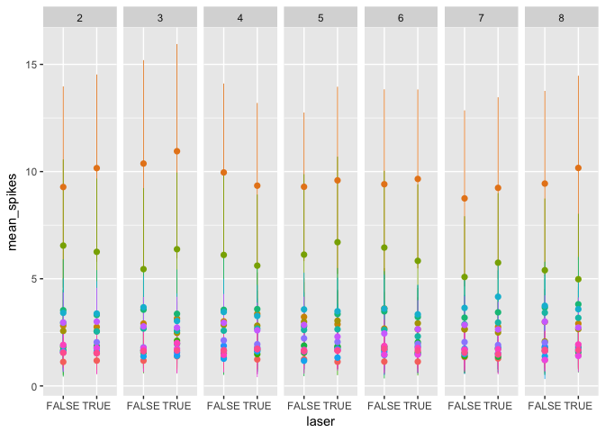
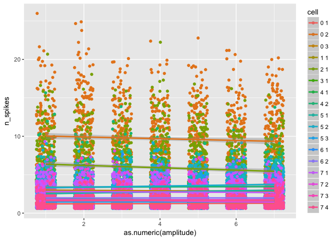

-   [Why R?](#why-r)
-   [Basic Syntax](#basic-syntax)
-   [Packages](#packages)
-   [Loading data](#loading-data)
-   [Manipulating Data](#manipulating-data)
-   [Plots](#plots)
-   [Stats](#stats)
    -   [Linear Models](#linear-models)
    -   [Nonparametric tests](#nonparametric-tests)

Why R?
======

-   Purpose-built for stats & data analysis - syntax is straightforward,
    well-implemented, and relatively static
-   R Community - huge amount of centrally hosted, well-designed
    software with documentation to match. (vs. the nightmarish
    MATLAB central)
-   Free, Open Source - Important not only for the state and future of
    computing, but also for open, reproducible science because your code
    can be run by anyone even if they don't have a MATLAB site license.
-   Typesetting - do your statistics in the same document as your
    manuscript, never worry about copy and pasting a number wrong.
-   Plotting - ggplot2 makes MATLAB plotting look like crayon playtime

Basic Syntax
============

R has some familiar and some unfamilar syntax.

Assignment works using both the `<-` (typical) and `=` operators, they
are slightly different but in most cases are interchangeable

    x <- 1
    x

    ## [1] 1

Get help with `?`

    ?lm

The most basic data class, a list, is declared with the `c()` operator.
See my lesson on
[objects](https://uodatascience.github.io/R_Guide/0201_Objects.html) for
more detail. some examples:

    # Vector
    x <- c(1,2,3,4,5,6)
    x

    ## [1] 1 2 3 4 5 6

    # Indexing uses []
    x[2]

    ## [1] 2

    # Matrices (arrays w/ 2 dimensions)
    y <- matrix(1:24, ncol=3, nrow=8)
    y

    ##      [,1] [,2] [,3]
    ## [1,]    1    9   17
    ## [2,]    2   10   18
    ## [3,]    3   11   19
    ## [4,]    4   12   20
    ## [5,]    5   13   21
    ## [6,]    6   14   22
    ## [7,]    7   15   23
    ## [8,]    8   16   24

    # A vector can be made an array in a few ways
    matrix(x, nrow=2, ncol=3)

    ##      [,1] [,2] [,3]
    ## [1,]    1    3    5
    ## [2,]    2    4    6

    dim(x) <- c(2,3)

Data frames are one of the main ways of storing data, some examples:

    # Pull an existing dataframe for an example
    diamonds <- ggplot2::diamonds # the :: notation accesses a name from a package without loading the package

    head(diamonds) # show the first six rows and the header of a dataframe

    ## # A tibble: 6 x 10
    ##   carat       cut color clarity depth table price     x     y     z
    ##   <dbl>     <ord> <ord>   <ord> <dbl> <dbl> <int> <dbl> <dbl> <dbl>
    ## 1  0.23     Ideal     E     SI2  61.5    55   326  3.95  3.98  2.43
    ## 2  0.21   Premium     E     SI1  59.8    61   326  3.89  3.84  2.31
    ## 3  0.23      Good     E     VS1  56.9    65   327  4.05  4.07  2.31
    ## 4  0.29   Premium     I     VS2  62.4    58   334  4.20  4.23  2.63
    ## 5  0.31      Good     J     SI2  63.3    58   335  4.34  4.35  2.75
    ## 6  0.24 Very Good     J    VVS2  62.8    57   336  3.94  3.96  2.48

    # Access named columns like this
    diamonds$carat[1:5]

    ## [1] 0.23 0.21 0.23 0.29 0.31

    # Logical indexing is similar to MATLAB

    diamonds[diamonds$carat >= 5,] 

    ## # A tibble: 1 x 10
    ##   carat   cut color clarity depth table price     x     y     z
    ##   <dbl> <ord> <ord>   <ord> <dbl> <dbl> <int> <dbl> <dbl> <dbl>
    ## 1  5.01  Fair     J      I1  65.5    59 18018 10.74 10.54  6.98

    # The additional comma is because the logical statement selects rows, a blank after a comma selects all the columns. For example, if we just wanted the first column we could
    diamonds[diamonds$carat >= 5,1] 

    ## # A tibble: 1 x 1
    ##   carat
    ##   <dbl>
    ## 1  5.01

    # or equivalently
    diamonds[diamonds$carat >= 5,]$carat

    ## [1] 5.01

Packages
========

Packages are installed from [https://cran.r-project.org](CRAN) by
default using

    # install.packages("package_name")

    # Install all the packages used in this demo
    # note that tidyverse is a metapackage that contains a lot of sub-packages
    # eg. plyr, which i will often refer to by name and load separately
    # install.packages(c("rio", "ggplot2", "R.matlab", "tidyverse", "binom", "pander", "lme4"))

Installed packaged are loaded into an R session using

    #library("package_name")

    # for example, load the packages that we'll be using
    library("ggplot2")
    library("rio")
    library("R.matlab")

    ## R.matlab v3.6.1 (2016-10-19) successfully loaded. See ?R.matlab for help.

    ## 
    ## Attaching package: 'R.matlab'

    ## The following objects are masked from 'package:base':
    ## 
    ##     getOption, isOpen

    library("reshape2")
    library("plyr")
    library("binom")
    library("pander")
    library("lme4")

    ## Loading required package: Matrix

    ## 
    ## Attaching package: 'lme4'

    ## The following object is masked from 'package:rio':
    ## 
    ##     factorize

    # If this is the first time you have loaded rio, you will be told you are missing some packages. install them too
    #install_formats()

Loading data
============

The `rio` package's `import` function makes importing other data formats
easy, it wraps a bunch of other packages that handle the actual
importing. In this case though, since the out files are mega-nested
gnarly matlab structures, we have to use `R.matlab`'s more flexible
`readMat` function.

We'll load some of Aldis' data, comparing spiking activity in mice
injected with halorhodopsin with and without laser stimulation. Because
loading the data using `readMat` takes forever, I'll just leave this
here, unevaluated, and used a cached version of that data. This is
shitty code, but I'm leaving it all in a for loop so make it linearly
readable.

    # Set this to wherever the repo landed on your computer
    laser_folder <- "/Users/jonny/GitHub/R_crash_course/data/laser"
    laser_files <- dir(laser_folder, pattern="outPSTH*")

    # Make a blank dataframe with our field names and data types
    laser_data <- data.frame(channel=integer(),
                             cluster=integer(),
                             laser=logical(),
                             amplitude=integer(),
                             rep=integer(),
                             spiketime=double())

    # loop through out files
    for(f in laser_files){
      print(f)
      # Load the file
      file <- file.path(laser_folder, f)
      out <- R.matlab::readMat(file)
      out <- out$out
      
      # Get field names for numerical indexing with which()
      field_names <- names(out[,,1])
      
      # Laser off first
      las_off <- which(field_names == "M1OFF")
      off <- drop(out[las_off,1,1][[1]]) # Get the M1OFF field, dropping singleton dimensions
      
      # A series of manipulation functions that massage the data into into "long" format
      off <- plyr::adply(off, c(1,2)) # adply usually applies a function, but here we just want it to group values by the first two dimensions of the array (amplitude and trial) and concatenate
      off <- melt(off, id.vars=c("X1","X2"), na.rm=TRUE) # Now we want to melt this back down so the columns with multiple spike times are flattened to a single column
      off <- off[,c(1,2,4)] # Subset the dataframe, leaving behind the spike # column
      
      # Format dataframe for concatenation
      names(off) <- c("amplitude", "rep", "spiketime") # rename fields
      off <- off[order(off$amplitude, off$rep),] # reorder by amp then rep
      off$amplitude <- as.integer(off$amplitude) # changing types and adding other variables
      off$rep <- as.integer(off$rep)
      off$channel <- as.integer(substr(f,11,11))
      off$cluster <- as.integer(substr(f,13,13))
      off$laser <- TRUE
      
      # then laser on
      las_on <- which(field_names == "M1ON")
      on <- drop(out[las_on,1,1][[1]])
      on <- plyr::adply(on, c(1,2))
      on <- melt(on, id.vars=c("X1","X2"), na.rm=TRUE)
      on <- on[,c(1,2,4)]
      
      # Format dataframe for concatenation
      names(on) <- c("amplitude", "rep", "spiketime")
      on <- on[order(on$amplitude, on$rep),]
      on$amplitude <- as.integer(on$amplitude)
      on$rep <- as.integer(on$rep)
      on$channel <- as.integer(substr(f,11,11))
      on$cluster <- as.integer(substr(f,13,13))
      on$laser <- FALSE
      
      # Concatenate to dataframe
      laser_data <- rbind(laser_data, off, on)
    }

    save(laser_data,file="/Users/jonny/GitHub/R_crash_course/data/laser.RData")

    # Load the laser data to the global environment
    load("/Users/jonny/GitHub/R_crash_course/data/laser.RData", .GlobalEnv)

    # Now our data is in the 'long' format
    head(laser_data)

    ##     amplitude rep  spiketime channel cluster laser
    ## 1           2   1  -6.733333       0       1  TRUE
    ## 8           2   2 187.666667       0       1  TRUE
    ## 50          2   8 -64.133333       0       1  TRUE
    ## 106         2  16  87.933333       0       1  TRUE
    ## 113         2  17 182.833333       0       1  TRUE
    ## 127         2  19 -97.400000       0       1  TRUE

Manipulating Data
=================

Once we have our data in the long format, manipulating it is trivial

    # we use ddply to summarize our data by cell (channel, cluster), amplitude, repetition, and laser on/off
    # first make a cell column that just groups channel and cluster into one column
    laser_data$cell <- paste(laser_data$channel,laser_data$cluster)
    laser_data$cell <- as.factor(laser_data$cell)

    # also retype some stuff
    laser_data$amplitude <- as.ordered(laser_data$amplitude)
    laser_data$laser <- as.factor(laser_data$laser)

    rep_spikes <- ddply(laser_data, .(cell, amplitude, laser, rep), summarize,
                        n_spikes = length(spiketime))
    head(rep_spikes)

    ##   cell amplitude laser rep n_spikes
    ## 1  0 1         2 FALSE   4        1
    ## 2  0 1         2 FALSE  18        1
    ## 3  0 1         2 FALSE  21        1
    ## 4  0 1         2 FALSE  23        1
    ## 5  0 1         2 FALSE  29        1
    ## 6  0 1         2 FALSE  40        1

    # Or collapsing across repetitions
    spikes <- ddply(rep_spikes, .(cell, amplitude, laser), summarize,
                    mean_spikes = mean(n_spikes),
                    sd_spikes = sd(n_spikes))

    head(spikes)

    ##   cell amplitude laser mean_spikes sd_spikes
    ## 1  0 1         2 FALSE    1.120000 0.3316625
    ## 2  0 1         2  TRUE    1.181818 0.4646602
    ## 3  0 1         3 FALSE    1.179487 0.3887764
    ## 4  0 1         3  TRUE    1.384615 0.6733805
    ## 5  0 1         4 FALSE    1.324324 0.5298875
    ## 6  0 1         4  TRUE    1.236842 0.5419789

    # Or by laser condition
    spikes_xy <- ddply(rep_spikes, .(cell, amplitude), summarize,
                       mean_laser_spikes = mean(n_spikes[laser==TRUE]),
                       mean_nolaser_spikes = mean(n_spikes[laser==FALSE]))

An example from my behavior data

    load("/Users/jonny/GitHub/R_crash_course/data/gendat.RData", .GlobalEnv)

    head(gendat)

    ##       trialNumber consonant speaker vowel token correct gentype step
    ## 42272       45936         2       2     1     1       1       1   15
    ## 42273       45937         2       1     1     1       1       1   15
    ## 42274       45938         2       2     1     1       1       1   15
    ## 42275       45939         1       2     1     1       1       1   15
    ## 42276       45941         1       2     1     1       1       1   15
    ## 42277       45943         2       4     6     2       0       3   15
    ##       session     date response target mouse toknov spknov vownov allnov
    ## 42272     105 736517.8        1      1  6924      0      0      0      0
    ## 42273     105 736517.8        1      1  6924      0      0      0      0
    ## 42274     105 736517.8        1      1  6924      0      0      0      0
    ## 42275     105 736517.8        0      0  6924      0      0      0      0
    ## 42276     105 736517.8        0      0  6924      0      0      0      0
    ## 42277     105 736517.8        0      1  6924      0      0      0      1
    ##       gentype2 novelnot
    ## 42272        1        0
    ## 42273        1        0
    ## 42274        1        0
    ## 42275        1        0
    ## 42276        1        0
    ## 42277        5        1

    gendat.mouse_type <- ddply(gendat,.(mouse,gentype2),plyr::summarize, 
                          meancx   = mean(correct),
                          meanresp = mean(response),
                          meantarg = mean(target),
                          cilo     = 
                            binom.confint(sum(correct),length(correct),conf.level=0.95,method="exact")[[5]],
                          cihi     =
                            binom.confint(sum(correct),length(correct),conf.level=0.95,method="exact")[[6]],
                          nobs     = length(correct))

    head(gendat.mouse_type)

    ##   mouse gentype2    meancx  meanresp  meantarg      cilo      cihi  nobs
    ## 1  6924        1 0.6903276 0.5152216 0.5008863 0.6822914 0.6982783 12975
    ## 2  6924        2 0.6666667 0.4650794 0.4587302 0.6283466 0.7034157   630
    ## 3  6924        3 0.6718750 0.4973958 0.4869792 0.6224206 0.7186548   384
    ## 4  6924        4 0.6505429 0.5074038 0.4876604 0.6202834 0.6799244  1013
    ## 5  6924        5 0.6112084 0.4973730 0.4956217 0.5822408 0.6396015  1142
    ## 6  6925        1 0.7922657 0.4775890 0.5529330 0.7851904 0.7992100 13007

Plots
=====

More detail on plotting can be found in my
[https://github.com/uodatascience/ggplot\_guide](ggplot%20guide), but a
quick plot shows us what we have

    g.spikes_xy <- ggplot(spikes_xy, aes(x=mean_laser_spikes, y=mean_nolaser_spikes, color=cell))+
      geom_abline(intercept=0, slope=1)+
      geom_point()+
      coord_fixed()+
      theme(legend.position = "none")
    g.spikes_xy

    g.spike_ranges <- ggplot(spikes, aes(x=laser, color=as.factor(cell)))+
      geom_pointrange(aes(y=mean_spikes, ymin=mean_spikes-sd_spikes, ymax=mean_spikes+sd_spikes), size=0.3)+
      facet_grid(.~amplitude, scales="free")+
      theme(legend.position = "none")
    g.spike_ranges

the good ole raster

    g.raster <- ggplot(laser_data[laser_data$cell == "0 1",])+
      geom_point(aes(x=spiketime, y=interaction(rep,laser), color=laser), size=0.5)+
      facet_grid(amplitude~.)+
      theme(axis.text.y = element_blank())
    g.raster

    g.raster_all <- ggplot(laser_data)+
      geom_point(aes(x=spiketime, y=interaction(rep,amplitude,laser), color=laser), size=0.1, alpha=0.5)+
      facet_grid(cell~.)+
      scale_color_brewer(palette="Set1")+
      theme(axis.text.y = element_blank())
    g.raster_all

    g.raster_side <- ggplot(laser_data)+
      geom_point(aes(x=spiketime, y=interaction(rep,amplitude), color=laser), size=0.1, alpha=0.5)+
      facet_grid(cell~laser)+
      scale_color_brewer(palette="Set1")+
      theme(axis.text.y = element_blank())
    g.raster_side 

    g.density <- ggplot(laser_data[laser_data$cell == "0 1",], aes(spiketime, ..count.., fill=as.factor(amplitude)))+
      geom_density(position="fill", color=NA, alpha=0.4)+
      geom_point(aes(x=spiketime,y=(700-as.numeric(interaction(rep,amplitude)))/700, color=as.factor(amplitude)))+
      facet_grid(.~laser)+
      scale_fill_brewer(palette="Set1")+
      scale_color_brewer(palette="Set1")+
      theme(axis.text.y = element_blank(),
            axis.ticks.y = element_blank(),
            plot.background = element_blank(),
            panel.background = element_rect(fill="gray"),
            panel.grid = element_blank(),
            legend.position = "none")
    g.density

Stats
=====

Linear Models
-------------

All linear models use `lm` and `glm` (regression, ANOVA, etc.). (see
`?lm` and `?glm`).

So, to ANCOVA firing rate by laser and amplitude... (note: don't do
this, since the spike data is nested within each cell, you can't model
the data like this. use summarized (mean) data in that case.)

    # Since our amplitude isn't really a number, but it is ordered, we cast it as an ordered factor. lm will run linear-n_levels polynomial contrasts.
    rep_spikes$amplitude <- as.ordered(rep_spikes$amplitude)

    # We regress n_spikes on different combinations of predictors using the formula ~ notation
    # Doing hierarchal regression like we should... 
    # First level predictors
    laser.lm1 <- lm(n_spikes ~ as.factor(laser), data=rep_spikes)
    laser.lm2 <- lm(n_spikes ~ amplitude, data=rep_spikes)
    laser.lm3 <- lm(n_spikes ~ cell, data=rep_spikes)

    # Second level predictors
    laser.lm4 <- lm(n_spikes ~ as.factor(laser) + amplitude + cell, data=rep_spikes) # Multiple regressors
    laser.lm5 <- lm(n_spikes ~ as.factor(laser) * amplitude + cell, data=rep_spikes) # Multiple regressors with interaction
    laser.lm6 <- lm(n_spikes ~ as.factor(laser) * cell + amplitude, data=rep_spikes)
    laser.lm7 <- lm(n_spikes ~ as.factor(laser) + amplitude * cell, data=rep_spikes)
    laser.lm8 <- lm(n_spikes ~ as.factor(laser) * amplitude * cell, data=rep_spikes)

    # Model comparison

    pander(anova(laser.lm1, laser.lm2, laser.lm3, laser.lm4, laser.lm5, laser.lm6, laser.lm7, laser.lm8))

<table style="width:78%;">
<caption>Analysis of Variance Table</caption>
<colgroup>
<col width="12%" />
<col width="12%" />
<col width="8%" />
<col width="16%" />
<col width="12%" />
<col width="15%" />
</colgroup>
<thead>
<tr class="header">
<th align="center">Res.Df</th>
<th align="center">RSS</th>
<th align="center">Df</th>
<th align="center">Sum of Sq</th>
<th align="center">F</th>
<th align="center">Pr(&gt;F)</th>
</tr>
</thead>
<tbody>
<tr class="odd">
<td align="center">16411</td>
<td align="center">152141</td>
<td align="center">NA</td>
<td align="center">NA</td>
<td align="center">NA</td>
<td align="center">NA</td>
</tr>
<tr class="even">
<td align="center">16406</td>
<td align="center">152102</td>
<td align="center">5</td>
<td align="center">38.6</td>
<td align="center">1.846</td>
<td align="center">0.1002</td>
</tr>
<tr class="odd">
<td align="center">16396</td>
<td align="center">69061</td>
<td align="center">10</td>
<td align="center">83041</td>
<td align="center">1986</td>
<td align="center">0</td>
</tr>
<tr class="even">
<td align="center">16389</td>
<td align="center">69023</td>
<td align="center">7</td>
<td align="center">37.88</td>
<td align="center">1.294</td>
<td align="center">0.2485</td>
</tr>
<tr class="odd">
<td align="center">16383</td>
<td align="center">68992</td>
<td align="center">6</td>
<td align="center">30.96</td>
<td align="center">1.234</td>
<td align="center">0.2852</td>
</tr>
<tr class="even">
<td align="center">16373</td>
<td align="center">68948</td>
<td align="center">10</td>
<td align="center">44.41</td>
<td align="center">1.062</td>
<td align="center">0.388</td>
</tr>
<tr class="odd">
<td align="center">16293</td>
<td align="center">68091</td>
<td align="center">80</td>
<td align="center">857.1</td>
<td align="center">2.562</td>
<td align="center">8.159e-13</td>
</tr>
<tr class="even">
<td align="center">16175</td>
<td align="center">67639</td>
<td align="center">118</td>
<td align="center">451.7</td>
<td align="center">0.9153</td>
<td align="center">0.7337</td>
</tr>
</tbody>
</table>

    # summarize one of the significant ones
    pander(summary(laser.lm3))

<table style="width:88%;">
<colgroup>
<col width="25%" />
<col width="15%" />
<col width="18%" />
<col width="13%" />
<col width="15%" />
</colgroup>
<thead>
<tr class="header">
<th align="center"> </th>
<th align="center">Estimate</th>
<th align="center">Std. Error</th>
<th align="center">t value</th>
<th align="center">Pr(&gt;|t|)</th>
</tr>
</thead>
<tbody>
<tr class="odd">
<td align="center"><strong>(Intercept)</strong></td>
<td align="center">1.243</td>
<td align="center">0.09517</td>
<td align="center">13.06</td>
<td align="center">8.665e-39</td>
</tr>
<tr class="even">
<td align="center"><strong>cell0 2</strong></td>
<td align="center">8.443</td>
<td align="center">0.1099</td>
<td align="center">76.83</td>
<td align="center">0</td>
</tr>
<tr class="odd">
<td align="center"><strong>cell0 3</strong></td>
<td align="center">1.668</td>
<td align="center">0.1118</td>
<td align="center">14.92</td>
<td align="center">5.112e-50</td>
</tr>
<tr class="even">
<td align="center"><strong>cell1 1</strong></td>
<td align="center">1.511</td>
<td align="center">0.1115</td>
<td align="center">13.55</td>
<td align="center">1.322e-41</td>
</tr>
<tr class="odd">
<td align="center"><strong>cell2 1</strong></td>
<td align="center">4.66</td>
<td align="center">0.1103</td>
<td align="center">42.26</td>
<td align="center">0</td>
</tr>
<tr class="even">
<td align="center"><strong>cell3 1</strong></td>
<td align="center">0.4443</td>
<td align="center">0.1397</td>
<td align="center">3.181</td>
<td align="center">0.00147</td>
</tr>
<tr class="odd">
<td align="center"><strong>cell4 1</strong></td>
<td align="center">0.4899</td>
<td align="center">0.1509</td>
<td align="center">3.246</td>
<td align="center">0.001173</td>
</tr>
<tr class="even">
<td align="center"><strong>cell4 2</strong></td>
<td align="center">2.171</td>
<td align="center">0.1106</td>
<td align="center">19.63</td>
<td align="center">8.444e-85</td>
</tr>
<tr class="odd">
<td align="center"><strong>cell5 1</strong></td>
<td align="center">1.521</td>
<td align="center">0.1108</td>
<td align="center">13.73</td>
<td align="center">1.107e-42</td>
</tr>
<tr class="even">
<td align="center"><strong>cell5 2</strong></td>
<td align="center">2.28</td>
<td align="center">0.11</td>
<td align="center">20.73</td>
<td align="center">2.772e-94</td>
</tr>
<tr class="odd">
<td align="center"><strong>cell5 3</strong></td>
<td align="center">0.2122</td>
<td align="center">0.1378</td>
<td align="center">1.54</td>
<td align="center">0.1237</td>
</tr>
<tr class="even">
<td align="center"><strong>cell6 1</strong></td>
<td align="center">0.4746</td>
<td align="center">0.119</td>
<td align="center">3.988</td>
<td align="center">6.705e-05</td>
</tr>
<tr class="odd">
<td align="center"><strong>cell6 2</strong></td>
<td align="center">0.7346</td>
<td align="center">0.1139</td>
<td align="center">6.447</td>
<td align="center">1.172e-10</td>
</tr>
<tr class="even">
<td align="center"><strong>cell7 1</strong></td>
<td align="center">1.507</td>
<td align="center">0.1109</td>
<td align="center">13.6</td>
<td align="center">7.206e-42</td>
</tr>
<tr class="odd">
<td align="center"><strong>cell7 2</strong></td>
<td align="center">0.3534</td>
<td align="center">0.1265</td>
<td align="center">2.794</td>
<td align="center">0.005215</td>
</tr>
<tr class="even">
<td align="center"><strong>cell7 3</strong></td>
<td align="center">0.4814</td>
<td align="center">0.1211</td>
<td align="center">3.975</td>
<td align="center">7.078e-05</td>
</tr>
<tr class="odd">
<td align="center"><strong>cell7 4</strong></td>
<td align="center">0.3867</td>
<td align="center">0.1152</td>
<td align="center">3.358</td>
<td align="center">0.0007863</td>
</tr>
</tbody>
</table>

<table style="width:86%;">
<caption>Fitting linear model: n_spikes ~ cell</caption>
<colgroup>
<col width="20%" />
<col width="30%" />
<col width="12%" />
<col width="22%" />
</colgroup>
<thead>
<tr class="header">
<th align="center">Observations</th>
<th align="center">Residual Std. Error</th>
<th align="center"><em>R</em>2</th>
<th align="center">Adjusted <em>R</em>2</th>
</tr>
</thead>
<tbody>
<tr class="odd">
<td align="center">16413</td>
<td align="center">2.052</td>
<td align="center">0.5461</td>
<td align="center">0.5456</td>
</tr>
</tbody>
</table>

ggplot also can do its own modeling

    ggplot(rep_spikes, aes(x=as.numeric(amplitude), y=n_spikes, color=cell))+
      geom_point(position=position_jitter(width=0.25))+
      geom_smooth(method="lm")

and you can plot basic diagnostic stats

    plot(laser.lm3)

`glm` can be used for ... well generalized linear models - so if we
wanted to do a logistic regression...

    # Subset generalization data to just the best mouse
    gen12 <- gendat[gendat$mouse == "7012",]

    # Regress the binomial correct/incorrect responses against the type of generalization
    gen12.lm <- glm(correct ~ gentype2, data=gen12, family="binomial")
    pander(summary(gen12.lm))

<table style="width:89%;">
<colgroup>
<col width="25%" />
<col width="15%" />
<col width="18%" />
<col width="13%" />
<col width="16%" />
</colgroup>
<thead>
<tr class="header">
<th align="center"> </th>
<th align="center">Estimate</th>
<th align="center">Std. Error</th>
<th align="center">z value</th>
<th align="center">Pr(&gt;|z|)</th>
</tr>
</thead>
<tbody>
<tr class="odd">
<td align="center"><strong>(Intercept)</strong></td>
<td align="center">1.849</td>
<td align="center">0.01348</td>
<td align="center">137.2</td>
<td align="center">0</td>
</tr>
<tr class="even">
<td align="center"><strong>gentype22</strong></td>
<td align="center">-0.4675</td>
<td align="center">0.0546</td>
<td align="center">-8.563</td>
<td align="center">1.095e-17</td>
</tr>
<tr class="odd">
<td align="center"><strong>gentype23</strong></td>
<td align="center">-0.798</td>
<td align="center">0.04552</td>
<td align="center">-17.53</td>
<td align="center">8.004e-69</td>
</tr>
<tr class="even">
<td align="center"><strong>gentype24</strong></td>
<td align="center">-0.9528</td>
<td align="center">0.03945</td>
<td align="center">-24.15</td>
<td align="center">7.742e-129</td>
</tr>
<tr class="odd">
<td align="center"><strong>gentype25</strong></td>
<td align="center">-1.117</td>
<td align="center">0.04345</td>
<td align="center">-25.7</td>
<td align="center">1.09e-145</td>
</tr>
</tbody>
</table>

(Dispersion parameter for binomial family taken to be 1 )

<table style="width:69%;">
<colgroup>
<col width="29%" />
<col width="40%" />
</colgroup>
<tbody>
<tr class="odd">
<td align="center">Null deviance:</td>
<td align="center">51490 on 58046 degrees of freedom</td>
</tr>
<tr class="even">
<td align="center">Residual deviance:</td>
<td align="center">50266 on 58042 degrees of freedom</td>
</tr>
</tbody>
</table>

We do generalized linear mixed models with the `lme4` package's `lmer`
and `glmer` functions

    laser.glm1 <- lmer(n_spikes ~ laser + (1+laser|cell), data=rep_spikes)
    summary(laser.glm1)

    ## Linear mixed model fit by REML ['lmerMod']
    ## Formula: n_spikes ~ laser + (1 + laser | cell)
    ##    Data: rep_spikes
    ## 
    ## REML criterion at convergence: 70290.2
    ## 
    ## Scaled residuals: 
    ##     Min      1Q  Median      3Q     Max 
    ## -4.2976 -0.3740 -0.2061  0.3823  8.0183 
    ## 
    ## Random effects:
    ##  Groups   Name        Variance Std.Dev. Corr
    ##  cell     (Intercept) 4.218362 2.05387      
    ##           laserTRUE   0.007147 0.08454  1.00
    ##  Residual             4.210196 2.05188      
    ## Number of obs: 16413, groups:  cell, 17
    ## 
    ## Fixed effects:
    ##              Estimate Std. Error t value
    ## (Intercept)  2.854669   0.498718   5.724
    ## laserTRUE   -0.004814   0.038042  -0.127
    ## 
    ## Correlation of Fixed Effects:
    ##           (Intr)
    ## laserTRUE 0.511

    # We can get the random effect of the laser (the effect of the laser that is specific to the cell) using ranef
    pander(ranef(laser.glm1))

    ## Warning in pander.default(ranef(laser.glm1)): No pander.method for
    ## "ranef.mer", reverting to default.

-   **cell**:

    <table style="width:49%;">
    <colgroup>
    <col width="13%" />
    <col width="19%" />
    <col width="15%" />
    </colgroup>
    <thead>
    <tr class="header">
    <th align="center"> </th>
    <th align="center">(Intercept)</th>
    <th align="center">laserTRUE</th>
    </tr>
    </thead>
    <tbody>
    <tr class="odd">
    <td align="center"><strong>0 1</strong></td>
    <td align="center">-1.57</td>
    <td align="center">-0.06461</td>
    </tr>
    <tr class="even">
    <td align="center"><strong>0 2</strong></td>
    <td align="center">6.693</td>
    <td align="center">0.2755</td>
    </tr>
    <tr class="odd">
    <td align="center"><strong>0 3</strong></td>
    <td align="center">0.05782</td>
    <td align="center">0.00238</td>
    </tr>
    <tr class="even">
    <td align="center"><strong>1 1</strong></td>
    <td align="center">-0.09735</td>
    <td align="center">-0.004007</td>
    </tr>
    <tr class="odd">
    <td align="center"><strong>2 1</strong></td>
    <td align="center">2.986</td>
    <td align="center">0.1229</td>
    </tr>
    <tr class="even">
    <td align="center"><strong>3 1</strong></td>
    <td align="center">-1.136</td>
    <td align="center">-0.04677</td>
    </tr>
    <tr class="odd">
    <td align="center"><strong>4 1</strong></td>
    <td align="center">-1.091</td>
    <td align="center">-0.04492</td>
    </tr>
    <tr class="even">
    <td align="center"><strong>4 2</strong></td>
    <td align="center">0.5504</td>
    <td align="center">0.02265</td>
    </tr>
    <tr class="odd">
    <td align="center"><strong>5 1</strong></td>
    <td align="center">-0.08723</td>
    <td align="center">-0.003591</td>
    </tr>
    <tr class="even">
    <td align="center"><strong>5 2</strong></td>
    <td align="center">0.6554</td>
    <td align="center">0.02698</td>
    </tr>
    <tr class="odd">
    <td align="center"><strong>5 3</strong></td>
    <td align="center">-1.365</td>
    <td align="center">-0.05619</td>
    </tr>
    <tr class="even">
    <td align="center"><strong>6 1</strong></td>
    <td align="center">-1.111</td>
    <td align="center">-0.04572</td>
    </tr>
    <tr class="odd">
    <td align="center"><strong>6 2</strong></td>
    <td align="center">-0.8562</td>
    <td align="center">-0.03524</td>
    </tr>
    <tr class="even">
    <td align="center"><strong>7 1</strong></td>
    <td align="center">-0.1014</td>
    <td align="center">-0.004174</td>
    </tr>
    <tr class="odd">
    <td align="center"><strong>7 2</strong></td>
    <td align="center">-1.227</td>
    <td align="center">-0.0505</td>
    </tr>
    <tr class="even">
    <td align="center"><strong>7 3</strong></td>
    <td align="center">-1.104</td>
    <td align="center">-0.04545</td>
    </tr>
    <tr class="odd">
    <td align="center"><strong>7 4</strong></td>
    <td align="center">-1.196</td>
    <td align="center">-0.04924</td>
    </tr>
    </tbody>
    </table>

<!-- end of list -->
    # or for amplitude
    laser.glm2 <- lmer(n_spikes ~ amplitude + (1+amplitude|cell), data=rep_spikes)
    summary(laser.glm2)

    ## Linear mixed model fit by REML ['lmerMod']
    ## Formula: n_spikes ~ amplitude + (1 + amplitude | cell)
    ##    Data: rep_spikes
    ## 
    ## REML criterion at convergence: 70190.2
    ## 
    ## Scaled residuals: 
    ##     Min      1Q  Median      3Q     Max 
    ## -4.6666 -0.4334 -0.1770  0.3706  7.9410 
    ## 
    ## Random effects:
    ##  Groups   Name        Variance Std.Dev. Corr                         
    ##  cell     (Intercept) 4.395196 2.09647                               
    ##           amplitude.L 0.076810 0.27715  -0.71                        
    ##           amplitude.Q 0.057852 0.24053   0.09  0.48                  
    ##           amplitude.C 0.056351 0.23738   0.48 -0.06  0.71            
    ##           amplitude^4 0.017952 0.13399  -0.18 -0.44 -0.90 -0.85      
    ##           amplitude^5 0.034869 0.18673   0.90 -0.85 -0.23  0.39  0.02
    ##           amplitude^6 0.002934 0.05416  -0.23  0.19  0.08  0.48 -0.40
    ##  Residual             4.170229 2.04211                               
    ##       
    ##       
    ##       
    ##       
    ##       
    ##       
    ##       
    ##   0.04
    ##       
    ## Number of obs: 16413, groups:  cell, 17
    ## 
    ## Fixed effects:
    ##              Estimate Std. Error t value
    ## (Intercept)  2.851309   0.508788   5.604
    ## amplitude.L -0.039925   0.080364  -0.497
    ## amplitude.Q  0.011950   0.073192   0.163
    ## amplitude.C  0.061348   0.072498   0.846
    ## amplitude^4  0.041396   0.053600   0.772
    ## amplitude^5  0.013858   0.062153   0.223
    ## amplitude^6  0.008537   0.044349   0.193
    ## 
    ## Correlation of Fixed Effects:
    ##             (Intr) ampl.L ampl.Q ampl.C ampl^4 ampl^5
    ## amplitude.L -0.594                                   
    ## amplitude.Q  0.071  0.330                            
    ## amplitude.C  0.379 -0.037  0.468                     
    ## amplitude^4 -0.111 -0.236 -0.451 -0.426              
    ## amplitude^5  0.657 -0.524 -0.143  0.231  0.011       
    ## amplitude^6 -0.069  0.048  0.015  0.123 -0.077  0.017

    pander(ranef(laser.glm2))

    ## Warning in pander.default(ranef(laser.glm2)): No pander.method for
    ## "ranef.mer", reverting to default.

-   **cell**:

    <table>
    <caption>Table continues below</caption>
    <colgroup>
    <col width="12%" />
    <col width="17%" />
    <col width="17%" />
    <col width="17%" />
    <col width="17%" />
    <col width="17%" />
    </colgroup>
    <thead>
    <tr class="header">
    <th align="center"> </th>
    <th align="center">(Intercept)</th>
    <th align="center">amplitude.L</th>
    <th align="center">amplitude.Q</th>
    <th align="center">amplitude.C</th>
    <th align="center">amplitude^4</th>
    </tr>
    </thead>
    <tbody>
    <tr class="odd">
    <td align="center"><strong>0 1</strong></td>
    <td align="center">-1.603</td>
    <td align="center">0.1673</td>
    <td align="center">0.03699</td>
    <td align="center">-0.01278</td>
    <td align="center">-0.01734</td>
    </tr>
    <tr class="even">
    <td align="center"><strong>0 2</strong></td>
    <td align="center">6.833</td>
    <td align="center">-0.5569</td>
    <td align="center">0.2477</td>
    <td align="center">0.6188</td>
    <td align="center">-0.2111</td>
    </tr>
    <tr class="odd">
    <td align="center"><strong>0 3</strong></td>
    <td align="center">0.05871</td>
    <td align="center">-0.06763</td>
    <td align="center">0.01277</td>
    <td align="center">0.1039</td>
    <td align="center">-0.01936</td>
    </tr>
    <tr class="even">
    <td align="center"><strong>1 1</strong></td>
    <td align="center">-0.1094</td>
    <td align="center">-0.1553</td>
    <td align="center">-0.4281</td>
    <td align="center">-0.2827</td>
    <td align="center">0.1748</td>
    </tr>
    <tr class="odd">
    <td align="center"><strong>2 1</strong></td>
    <td align="center">3.051</td>
    <td align="center">-0.6577</td>
    <td align="center">-0.464</td>
    <td align="center">-0.3249</td>
    <td align="center">0.296</td>
    </tr>
    <tr class="even">
    <td align="center"><strong>3 1</strong></td>
    <td align="center">-1.156</td>
    <td align="center">0.08833</td>
    <td align="center">-0.005509</td>
    <td align="center">-0.02571</td>
    <td align="center">0.005769</td>
    </tr>
    <tr class="odd">
    <td align="center"><strong>4 1</strong></td>
    <td align="center">-1.112</td>
    <td align="center">0.01582</td>
    <td align="center">-0.1042</td>
    <td align="center">-0.08923</td>
    <td align="center">0.05667</td>
    </tr>
    <tr class="even">
    <td align="center"><strong>4 2</strong></td>
    <td align="center">0.561</td>
    <td align="center">0.09726</td>
    <td align="center">0.2224</td>
    <td align="center">0.2203</td>
    <td align="center">-0.1375</td>
    </tr>
    <tr class="odd">
    <td align="center"><strong>5 1</strong></td>
    <td align="center">-0.09396</td>
    <td align="center">0.308</td>
    <td align="center">0.3508</td>
    <td align="center">0.1212</td>
    <td align="center">-0.1581</td>
    </tr>
    <tr class="even">
    <td align="center"><strong>5 2</strong></td>
    <td align="center">0.6662</td>
    <td align="center">0.225</td>
    <td align="center">0.1278</td>
    <td align="center">-0.09271</td>
    <td align="center">-0.05827</td>
    </tr>
    <tr class="odd">
    <td align="center"><strong>5 3</strong></td>
    <td align="center">-1.394</td>
    <td align="center">0.1425</td>
    <td align="center">0.02407</td>
    <td align="center">-0.0473</td>
    <td align="center">0.0005423</td>
    </tr>
    <tr class="even">
    <td align="center"><strong>6 1</strong></td>
    <td align="center">-1.133</td>
    <td align="center">0.1288</td>
    <td align="center">0.01435</td>
    <td align="center">-0.031</td>
    <td align="center">-0.007033</td>
    </tr>
    <tr class="odd">
    <td align="center"><strong>6 2</strong></td>
    <td align="center">-0.8725</td>
    <td align="center">0.05166</td>
    <td align="center">-0.03688</td>
    <td align="center">-0.08518</td>
    <td align="center">0.03629</td>
    </tr>
    <tr class="even">
    <td align="center"><strong>7 1</strong></td>
    <td align="center">-0.1012</td>
    <td align="center">0.05033</td>
    <td align="center">0.1521</td>
    <td align="center">0.05648</td>
    <td align="center">-0.03964</td>
    </tr>
    <tr class="odd">
    <td align="center"><strong>7 2</strong></td>
    <td align="center">-1.252</td>
    <td align="center">-0.002554</td>
    <td align="center">-0.09189</td>
    <td align="center">-0.08455</td>
    <td align="center">0.06428</td>
    </tr>
    <tr class="even">
    <td align="center"><strong>7 3</strong></td>
    <td align="center">-1.123</td>
    <td align="center">0.09842</td>
    <td align="center">-0.007982</td>
    <td align="center">-0.02897</td>
    <td align="center">0.00282</td>
    </tr>
    <tr class="odd">
    <td align="center"><strong>7 4</strong></td>
    <td align="center">-1.219</td>
    <td align="center">0.06685</td>
    <td align="center">-0.05053</td>
    <td align="center">-0.0156</td>
    <td align="center">0.01118</td>
    </tr>
    </tbody>
    </table>

    <table style="width:53%;">
    <colgroup>
    <col width="13%" />
    <col width="19%" />
    <col width="19%" />
    </colgroup>
    <thead>
    <tr class="header">
    <th align="center"> </th>
    <th align="center">amplitude^5</th>
    <th align="center">amplitude^6</th>
    </tr>
    </thead>
    <tbody>
    <tr class="odd">
    <td align="center"><strong>0 1</strong></td>
    <td align="center">-0.1254</td>
    <td align="center">0.02466</td>
    </tr>
    <tr class="even">
    <td align="center"><strong>0 2</strong></td>
    <td align="center">0.5614</td>
    <td align="center">0.01388</td>
    </tr>
    <tr class="odd">
    <td align="center"><strong>0 3</strong></td>
    <td align="center">0.0404</td>
    <td align="center">0.02932</td>
    </tr>
    <tr class="even">
    <td align="center"><strong>1 1</strong></td>
    <td align="center">0.09911</td>
    <td align="center">0.008006</td>
    </tr>
    <tr class="odd">
    <td align="center"><strong>2 1</strong></td>
    <td align="center">0.2948</td>
    <td align="center">-0.1045</td>
    </tr>
    <tr class="even">
    <td align="center"><strong>3 1</strong></td>
    <td align="center">-0.08075</td>
    <td align="center">0.01752</td>
    </tr>
    <tr class="odd">
    <td align="center"><strong>4 1</strong></td>
    <td align="center">-0.05334</td>
    <td align="center">0.01426</td>
    </tr>
    <tr class="even">
    <td align="center"><strong>4 2</strong></td>
    <td align="center">0.01262</td>
    <td align="center">0.02242</td>
    </tr>
    <tr class="odd">
    <td align="center"><strong>5 1</strong></td>
    <td align="center">-0.1375</td>
    <td align="center">-0.02631</td>
    </tr>
    <tr class="even">
    <td align="center"><strong>5 2</strong></td>
    <td align="center">-0.06216</td>
    <td align="center">-0.06062</td>
    </tr>
    <tr class="odd">
    <td align="center"><strong>5 3</strong></td>
    <td align="center">-0.1203</td>
    <td align="center">0.008658</td>
    </tr>
    <tr class="even">
    <td align="center"><strong>6 1</strong></td>
    <td align="center">-0.09157</td>
    <td align="center">0.01367</td>
    </tr>
    <tr class="odd">
    <td align="center"><strong>6 2</strong></td>
    <td align="center">-0.07184</td>
    <td align="center">-0.005167</td>
    </tr>
    <tr class="even">
    <td align="center"><strong>7 1</strong></td>
    <td align="center">-0.06314</td>
    <td align="center">-0.02011</td>
    </tr>
    <tr class="odd">
    <td align="center"><strong>7 2</strong></td>
    <td align="center">-0.06718</td>
    <td align="center">0.01136</td>
    </tr>
    <tr class="even">
    <td align="center"><strong>7 3</strong></td>
    <td align="center">-0.07856</td>
    <td align="center">0.01793</td>
    </tr>
    <tr class="odd">
    <td align="center"><strong>7 4</strong></td>
    <td align="center">-0.0566</td>
    <td align="center">0.03498</td>
    </tr>
    </tbody>
    </table>

<!-- end of list -->
Or with the behavior data

    # Interaction model - effect of gentype2 allowed to vary by mouse, allow correlation between intercept devs (estimate correlation between intercept devs and gentype devs across mice)

    # we would call it like this, but it takes forever to fit so we just load
    # novtypes.lmer4 <- glmer(correct ~ gentype2 + (1 + gentype2|mouse),data=gendat,family=binomial)
    load("/Users/Jonny/GitHub/R_crash_course/data/lmer4.RData", .GlobalEnv)
    summary(novtypes.lmer4)

    ## Generalized linear mixed model fit by maximum likelihood (Laplace
    ##   Approximation) [glmerMod]
    ##  Family: binomial  ( logit )
    ## Formula: correct ~ gentype2 + (1 + gentype2 | mouse)
    ##    Data: gendat
    ## 
    ##       AIC       BIC    logLik  deviance  df.resid 
    ##  588730.6  588953.5 -294345.3  588690.6    512190 
    ## 
    ## Scaled residuals: 
    ##     Min      1Q  Median      3Q     Max 
    ## -2.5173 -1.2553  0.5508  0.6367  0.9348 
    ## 
    ## Random effects:
    ##  Groups Name        Variance Std.Dev. Corr                   
    ##  mouse  (Intercept) 0.12805  0.3578                          
    ##         gentype22   0.01555  0.1247   -0.41                  
    ##         gentype23   0.02759  0.1661   -0.72  0.80            
    ##         gentype24   0.04780  0.2186   -0.94  0.63  0.90      
    ##         gentype25   0.05304  0.2303   -0.89  0.60  0.94  0.97
    ## Number of obs: 512210, groups:  mouse, 17
    ## 
    ## Fixed effects:
    ##             Estimate Std. Error z value Pr(>|z|)    
    ## (Intercept)  1.02597    0.03597  28.525  < 2e-16 ***
    ## gentype22   -0.15798    0.02572  -6.142 8.14e-10 ***
    ## gentype23   -0.43523    0.02565 -16.970  < 2e-16 ***
    ## gentype24   -0.42701    0.02343 -18.222  < 2e-16 ***
    ## gentype25   -0.59425    0.02762 -21.518  < 2e-16 ***
    ## ---
    ## Signif. codes:  0 '***' 0.001 '**' 0.01 '*' 0.05 '.' 0.1 ' ' 1
    ## 
    ## Correlation of Fixed Effects:
    ##           (Intr) gnty22 gnty23 gnty24
    ## gentype22 -0.018                     
    ## gentype23 -0.168  0.405              
    ## gentype24 -0.631  0.336  0.493       
    ## gentype25 -0.521  0.224  0.596  0.644
    ## convergence code: 0
    ## Model failed to converge with max|grad| = 0.00220446 (tol = 0.001, component 1)

    pander(ranef(novtypes.lmer4))

    ## Warning in pander.default(ranef(novtypes.lmer4)): No pander.method for
    ## "ranef.mer", reverting to default.

-   **mouse**:

    <table>
    <colgroup>
    <col width="15%" />
    <col width="19%" />
    <col width="16%" />
    <col width="16%" />
    <col width="16%" />
    <col width="16%" />
    </colgroup>
    <thead>
    <tr class="header">
    <th align="center"> </th>
    <th align="center">(Intercept)</th>
    <th align="center">gentype22</th>
    <th align="center">gentype23</th>
    <th align="center">gentype24</th>
    <th align="center">gentype25</th>
    </tr>
    </thead>
    <tbody>
    <tr class="odd">
    <td align="center"><strong>6924</strong></td>
    <td align="center">-0.2221</td>
    <td align="center">0.1037</td>
    <td align="center">0.2034</td>
    <td align="center">0.21</td>
    <td align="center">0.2494</td>
    </tr>
    <tr class="even">
    <td align="center"><strong>6925</strong></td>
    <td align="center">0.3133</td>
    <td align="center">0.01147</td>
    <td align="center">-0.06677</td>
    <td align="center">-0.1576</td>
    <td align="center">-0.1592</td>
    </tr>
    <tr class="odd">
    <td align="center"><strong>6926</strong></td>
    <td align="center">-0.4823</td>
    <td align="center">0.1107</td>
    <td align="center">0.1162</td>
    <td align="center">0.2496</td>
    <td align="center">0.2059</td>
    </tr>
    <tr class="even">
    <td align="center"><strong>6927</strong></td>
    <td align="center">0.1666</td>
    <td align="center">0.08368</td>
    <td align="center">0.08527</td>
    <td align="center">-0.01903</td>
    <td align="center">0.0279</td>
    </tr>
    <tr class="odd">
    <td align="center"><strong>6928</strong></td>
    <td align="center">0.5833</td>
    <td align="center">-0.08623</td>
    <td align="center">-0.2581</td>
    <td align="center">-0.3637</td>
    <td align="center">-0.4122</td>
    </tr>
    <tr class="even">
    <td align="center"><strong>6960</strong></td>
    <td align="center">-0.4272</td>
    <td align="center">0.1125</td>
    <td align="center">0.2246</td>
    <td align="center">0.3004</td>
    <td align="center">0.3195</td>
    </tr>
    <tr class="odd">
    <td align="center"><strong>6964</strong></td>
    <td align="center">0.1786</td>
    <td align="center">0.08996</td>
    <td align="center">0.06597</td>
    <td align="center">-0.03933</td>
    <td align="center">0.0004362</td>
    </tr>
    <tr class="even">
    <td align="center"><strong>6965</strong></td>
    <td align="center">0.2561</td>
    <td align="center">0.1889</td>
    <td align="center">0.1072</td>
    <td align="center">-0.02636</td>
    <td align="center">-0.0164</td>
    </tr>
    <tr class="odd">
    <td align="center"><strong>6966</strong></td>
    <td align="center">-0.004774</td>
    <td align="center">0.04865</td>
    <td align="center">0.02388</td>
    <td align="center">0.05487</td>
    <td align="center">-0.002012</td>
    </tr>
    <tr class="even">
    <td align="center"><strong>6967</strong></td>
    <td align="center">-0.1232</td>
    <td align="center">-0.06762</td>
    <td align="center">-0.1926</td>
    <td align="center">-0.05939</td>
    <td align="center">-0.1738</td>
    </tr>
    <tr class="odd">
    <td align="center"><strong>7007</strong></td>
    <td align="center">0.1575</td>
    <td align="center">-0.08597</td>
    <td align="center">-0.081</td>
    <td align="center">-0.1024</td>
    <td align="center">-0.09837</td>
    </tr>
    <tr class="even">
    <td align="center"><strong>7012</strong></td>
    <td align="center">0.8204</td>
    <td align="center">-0.2617</td>
    <td align="center">-0.3663</td>
    <td align="center">-0.5284</td>
    <td align="center">-0.5188</td>
    </tr>
    <tr class="odd">
    <td align="center"><strong>7058</strong></td>
    <td align="center">-0.0862</td>
    <td align="center">-0.1131</td>
    <td align="center">-0.08992</td>
    <td align="center">-0.05806</td>
    <td align="center">-0.02781</td>
    </tr>
    <tr class="even">
    <td align="center"><strong>7105</strong></td>
    <td align="center">-0.06761</td>
    <td align="center">-0.109</td>
    <td align="center">-0.06314</td>
    <td align="center">-0.03582</td>
    <td align="center">-0.005661</td>
    </tr>
    <tr class="odd">
    <td align="center"><strong>7116</strong></td>
    <td align="center">-0.5153</td>
    <td align="center">0.07909</td>
    <td align="center">0.2141</td>
    <td align="center">0.317</td>
    <td align="center">0.3453</td>
    </tr>
    <tr class="even">
    <td align="center"><strong>7118</strong></td>
    <td align="center">-0.3065</td>
    <td align="center">-0.05005</td>
    <td align="center">0.01165</td>
    <td align="center">0.1319</td>
    <td align="center">0.1059</td>
    </tr>
    <tr class="odd">
    <td align="center"><strong>7120</strong></td>
    <td align="center">-0.2375</td>
    <td align="center">-0.06058</td>
    <td align="center">0.06106</td>
    <td align="center">0.1225</td>
    <td align="center">0.1566</td>
    </tr>
    </tbody>
    </table>

<!-- end of list -->
Nonparametric tests
-------------------

R can also do nonparametric models easily. For example if we wanted to
compare firing rates with and without laser for each cell, averaged
across amplitudes

    # Summarize over amplitudes
    spikes_laser <- ddply(rep_spikes, .(cell, laser), summarize,
                       mean_spikes = mean(n_spikes))

    # We spread this data back out because the wilcox

    # we used the paired wilcoxon signed-rank test because measurements are paired within cells
    laser_wilcox <- wilcox.test(mean_spikes~laser, data=spikes_laser, paired=TRUE)

    # or the friedman.test for treating the data as grouped within cells
    laser_friedman <- friedman.test(mean_spikes~laser|cell, data=spikes_laser)

    # another eg.,  a simple sign test on binomial data, here we see if a mouse is performing above chance on a particular day

    gen12_session <- gen12[gen12$session==200,]$correct
    binom.test(sum(gen12_session), length(gen12_session), alternative=c("greater"))

    ## 
    ##  Exact binomial test
    ## 
    ## data:  sum(gen12_session) and length(gen12_session)
    ## number of successes = 334, number of trials = 421, p-value <
    ## 2.2e-16
    ## alternative hypothesis: true probability of success is greater than 0.5
    ## 95 percent confidence interval:
    ##  0.7582057 1.0000000
    ## sample estimates:
    ## probability of success 
    ##              0.7933492
